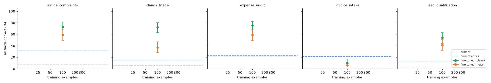

# Instructor dry run, 2–3 October 2026

One run of [`notebooks/instructor_dry_run.ipynb`](../../notebooks/instructor_dry_run.ipynb) on a **free Colab T4**, `MODE = "quick"`, all five scenarios, 100 held-out test cases each, followed by an extra experiment on `invoice_intake` (section 4 of the notebook).

**Headline:** at the default 100 clean examples (card B), fine-tuning clearly beats both baselines in four of five scenarios. `invoice_intake` is the exception: it needs about 300 examples. Giving a fine-tuned model the policy docs as well did not help, and at 300 examples it hurt.

## Files

| File | What it is |
|---|---|
| `nemotron_dry_run_results.csv` | Quick sweep: 20 runs (5 scenarios × prompt, prompt+docs, fine-tuned 100 clean, fine-tuned 100 noisy) |
| `nemotron_ft_plus_docs_results.csv` | Extra experiment on `invoice_intake`: 5 runs (see below) |
| `learning_curves.png` | The report's chart, regenerated from the first CSV with `core.sweep_report` |
| `instructor_dry_run_executed.ipynb` | The notebook with the outputs of this session |

## Quick sweep: all fields correct, 95% range in brackets

| Scenario | Prompt | Prompt + docs | Fine-tuned, 100 clean | Fine-tuned, 100 noisy |
|---|---|---|---|---|
| airline_complaints | 7% (3–14) | 31% (23–41) | 73% (64–81) | 59% (49–68) |
| claims_triage | 6% (3–12) | 15% (9–23) | 72% (63–80) | 37% (28–47) |
| expense_audit | 23% (16–32) | 22% (15–31) | 75% (66–82) | 59% (49–68) |
| invoice_intake | 1% (0–5) | 21% (14–30) | 10% (6–17) | 6% (3–12) |
| lead_qualification | 3% (1–8) | 12% (7–20) | 54% (44–63) | 41% (32–51) |

Recommendations table from `core.sweep_report`:

| Scenario | Fewest examples: clearly beats prompt | Fewest examples: clearly beats prompt + docs | Train minutes per 100 example-passes |
|---|---|---|---|
| airline_complaints | 100 | 100 | 5.7 |
| claims_triage | 100 | 100 | 5.8 |
| expense_audit | 100 | 100 | 4.4 |
| invoice_intake | 100 | not reached | 6.4 |
| lead_qualification | 100 | 100 | 4.7 |

Quick mode only tests 100 examples, so "100" means 100 was enough, not that it is the minimum.

### Per-field accuracy (%)

| Scenario | Field | Prompt | Prompt + docs | FT 100 clean | FT 100 noisy |
|---|---|---|---|---|---|
| airline_complaints | category | 59 | 78 | 98 | 90 |
| | priority | 38 | 75 | 83 | 80 |
| | route_to | 37 | 53 | 99 | 93 |
| | compensation | 32 | 69 | 86 | 84 |
| claims_triage | claim_type | 42 | 47 | 100 | 98 |
| | injury | 95 | 84 | 100 | 100 |
| | estimate_band | 25 | 39 | 81 | 49 |
| | route | 35 | 59 | 85 | 62 |
| expense_audit | expense_type | 64 | 55 | 99 | 99 |
| | decision | 67 | 43 | 76 | 59 |
| | reason | 30 | 24 | 77 | 61 |
| invoice_intake | vendor | 55 | 87 | 97 | 96 |
| | invoice_number | 92 | 78 | 100 | 100 |
| | amount_usd | 96 | 96 | 98 | 98 |
| | gl_code | 15 | 81 | 42 | 40 |
| | approval | 16 | 33 | 34 | 34 |
| lead_qualification | segment | 39 | 45 | 82 | 68 |
| | intent | 54 | 70 | 100 | 100 |
| | route | 15 | 21 | 62 | 55 |

Other things the sweep showed:

- **Valid JSON:** fine-tuned models returned valid JSON in 100% of cases in every scenario. The baselines mostly did too, except `expense_audit` with the policy pasted in (63%).
- **Noisy labels** (30% of rows with one wrong label) cost 13 to 35 points against clean labels in the four scenarios where fine-tuning worked. The largest drop is `claims_triage` (72% to 37%).
- **Prompt length:** pasting the policy in raises the prompt from 164–224 tokens to 458–557 tokens per request.

## Extra experiment: `invoice_intake` with more examples, and fine-tuned + docs

Two questions: does `invoice_intake` recover with more training examples, and does a fine-tuned model do better if it is also given the policy docs at test time?

"Fine-tuned" uses the normal prompt with no policy. "Fine-tuned + docs" is the same fine-tuned model with the policy pasted into the prompt. Training never includes the policy. All rows are clean labels, 2 epochs, 100 test cases.

| Training examples | Fine-tuned | Fine-tuned + docs |
|---|---|---|
| None (base model) | 1% (0–5) | 21% (14–30) |
| 100 | 10% (6–17) | not run |
| 200 | 38% (29–48) | 37% (28–47) |
| 300 | 57% (47–66) | 38% (29–48) |

Per-field accuracy (%):

| Setting | vendor | invoice_number | amount_usd | gl_code | approval |
|---|---|---|---|---|---|
| Base model, prompt | 55 | 92 | 96 | 15 | 16 |
| Base model, prompt + docs | 87 | 78 | 96 | 81 | 33 |
| Fine-tuned 100 | 97 | 100 | 98 | 42 | 34 |
| Fine-tuned 200 | 100 | 100 | 99 | 98 | 40 |
| Fine-tuned 200 + docs | 98 | 95 | 100 | 94 | 40 |
| Fine-tuned 300 | 100 | 100 | 99 | 99 | 58 |
| Fine-tuned 300 + docs | 100 | 100 | 100 | 96 | 39 |

What this shows:

- **`invoice_intake` needs about 300 examples.** At 300 the fine-tuned range (47–66) lies entirely above prompt + docs (14–30). At 200 the ranges still overlap by a point.
- **The GL code is learned by 200 examples** (42% at 100, 98% at 200). After that the **approval path is the bottleneck**: 34% at 100, 40% at 200, 58% at 300. Approval depends on a list of nine approved vendors and two dollar thresholds, which is hard to infer from a few hundred examples.
- **Docs do not help a fine-tuned model.** At 200 examples the two scores are the same within a point. At 300, adding the policy drops accuracy from 57% to 38%, and the whole drop is in the approval field (58% to 39%). The model was trained on prompts without the policy, so the prompt with the policy is a layout it never saw in training. This run does not test a model fine-tuned *with* the policy in its training prompts.

**Not finished:** the plan also included "100 clean + docs" and "100 noisy" with and without docs. Colab cut the GPU off (usage limit) during the "100 clean + docs" test, at 64 of 100 cases, so those three rows are missing. Re-running section 4 on a fresh GPU session picks up where it stopped. The repeat of "fine-tuned 100 clean" reproduced the quick sweep's result exactly (10%, 6–17).

## Timing on the free T4

| What | Measured |
|---|---|
| Whole quick sweep (20 runs) | about 3 hours 20 minutes (notebook previously said about 1 hour) |
| One fine-tune, 100 examples × 2 epochs | 8.8 to 12.8 minutes, depending on scenario |
| One fine-tune, 200 / 300 examples × 2 epochs (`invoice_intake`) | 25.0 / 37.9 minutes |
| One test pass of 100 cases, baseline | about 6 to 9 minutes |
| One test pass of 100 cases, fine-tuned | about 2 to 4 minutes (6.5 with the policy in the prompt) |
| Model download and load | about 2 minutes |
| GPU session before the free tier cut off | about 5.5 hours |

## What to change before class

- Cards B and D work as they are for `airline_complaints`, `claims_triage`, `expense_audit` and `lead_qualification`.
- For `invoice_intake`, either set `N_EXAMPLES` to 300 (about 38 minutes of training on a T4, too long for a 60-minute session) or do not assign it.
- `MODE = "full"` will not finish on a free T4 in one session.

## How these files were produced

- The run was driven through the Colab web page. The two CSVs were copied from the files Colab wrote to Google Drive.
- `instructor_dry_run_executed.ipynb` is the repository notebook with the session's cell outputs added as plain text. Colab's interactive tables and download progress widgets are not preserved. The chart in it is `learning_curves.png`, regenerated from the CSV by the same function.
- In the session, the section 4 code cell was added after the download cell without its heading; the code is identical.
- The download cell (`files.download(OUT)`) was not run.
